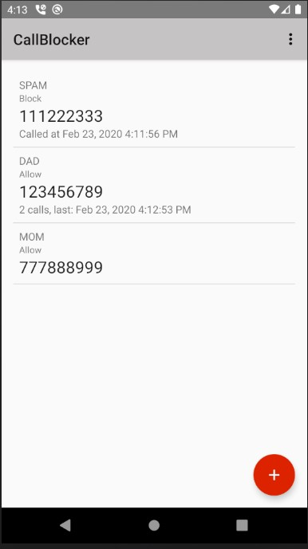
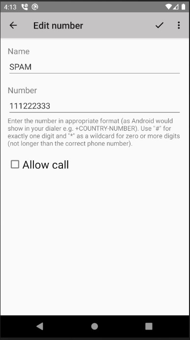
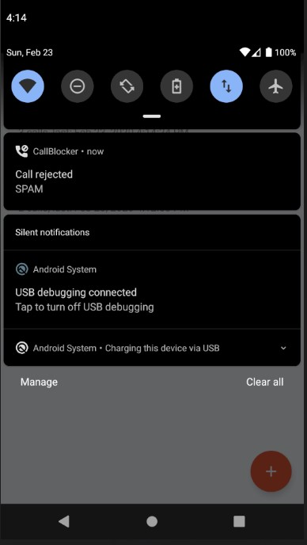
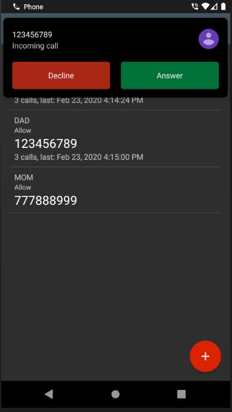
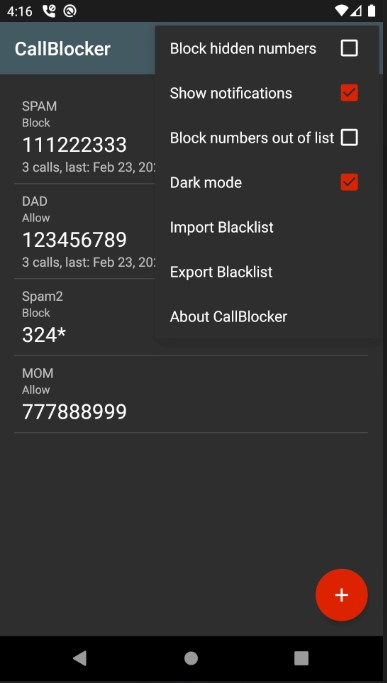

# CallBlocker

CallBlocker is a simple app that allows you to

* block unwanted calls from certain numbers or private numbers,
* enter numbers to be blocked with wildcards (for instance, you can block whole prefixes or companies),
* get notified about blocked calls (optional),
* view statistics about which caller was blocked how often and when they have called the last time.

CallBlocker is not intended as a feature-rich call-spam fighting app,
but as a replacement for Android's missing call blocking feature.

    

## License 

This program comes with ABSOLUTELY NO WARRANTY. This is free software, and you are welcome
to redistribute it under the conditions of the [GNU GPL v3](LICENSE).

Copyright (C) [NoPhoneSpam contributors](https://gitlab.com/bitfireAT/NoPhoneSpam/-/graphs/master)
(initial contributor: Ricki Hirner).

> Orginal web site: https://gitlab.com/bitfireAT/NoPhoneSpam/

Copyright (C) [eaglx](https://github.com/eaglx).

## Privacy policy

CallBlocker stores the blocked numbers in a local database. No information
is transmitted to anywhere in the Internet. There's no tracking and there are no ads.

